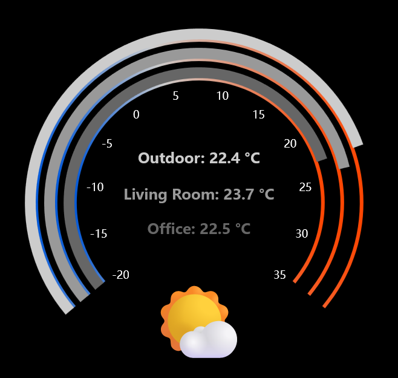

# Kraken Home Assistant Display

A simple, single-file HTML app to display Home Assistant sensor data on a NZXT Kraken AIO LCD screen (640x640px).

This project uses:
- [TailwindCSS + DaisyUI](https://daisyui.com/) (for basic input styling)
- [ECharts](https://echarts.apache.org/) (for dynamic ring gauges)
- WebSocket connection to Home Assistant (for live updates)
- LocalStorage (for storing settings)

---

## ✨ Features
- Displays **three temperature rings** (inner, middle, outer) with labels.
- Displays a **weather icon** based on Home Assistant weather entity.
- **Smooth gradient background** under each ring (blue → gray → red) from -20 to 35 with gray on 0 °C.
- **Foreground colored rings** for quick temperature reading.
- **Live WebSocket updates** (no polling needed after connection).
- **Offline storage** of Bearer Token and Home Assistant URL for easy reconnects.

---

## ⚙️ Setup
1. Open the NZXT CAM application and on LCD display select Web Integration
2. Pick Custom Integration and put `https://zmasek.github.io/kraken-home-assistant/` as the URL
3. Configure on the **settings panel**:
   - Home Assistant URL (e.g., `https://your-instance.ui.nabu.casa/` or your HTTPS URL)
   - Bearer Token (long-lived access token obtained from Home Assistant)
   - Sensor entities and attributes to monitor (if attribute is not put, it will attempt to search on the entity)
   - Labels for each ring
3. Click **Save Settings**.
4. The app will:
   - Save the settings in the LocalStorage so it can be obtained without configuration on the LCD display
   - Fetch initial values
   - Establish a WebSocket connection for live updates

---

## 🔥 Special Kraken Mode
When the app is loaded from a Kraken LCD, `?kraken=1` is added to the URL and the settings are not visible.

---

## 🛠 Technologies Used
- **HTML5 + JavaScript (Vanilla)**
- **TailwindCSS/DaisyUI** for fast styling of the inputs
- **Apache ECharts** for charts
- **WebSocket API** for live Home Assistant updates
- **LocalStorage API** for settings persistence

---

## 📈 Ring Color Mapping
- **Inner Ring** → Near sensor (example: Office temperature)
- **Middle Ring** → Mid sensor (example: Living Room temperature)
- **Outer Ring** → Far sensor (example: Outdoor temperature)

Each ring shows:
- Thin background ring (full range, colored by temperature gradient)
- Thick foreground ring (current value, colored distinctly in grayscale)

---

## 📋 Settings Explained
| Setting                    | Purpose                                       |
|:---------------------------|:----------------------------------------------|
| Bearer Token               | Access token for Home Assistant API           |
| Home Assistant URL         | Full URL to Home Assistant server             |
| Inner/Outer/Far Ring State | Entity ID to monitor (e.g., `climate.office`) |
| Ring Attribute             | Optional. Specific attribute to monitor       |
| Ring Label                 | Text displayed inside the ring                |
| Weather Icon State         | Weather entity ID (e.g., `weather.home`)      |
| Weather Icon Attribute     | Optional. Specific attribute if needed        |

---

## 💬 Notes
- The system expects Home Assistant states or attributes to return numeric temperatures.
- Weather condition states should match known icons (`sunny`, `cloudy`, `rainy`, etc.) — fallback is ☀️ sunny.
- Token and settings are stored in `localStorage` only (no backend/server needed).
- Configuration is mandatory except possibly attributes. YMMV.

---

## 📜 License
This project is released under the [MIT License](https://opensource.org/licenses/MIT).

---

## 🙏 Credits
Thanks to:
- Home Assistant community
- Apache ECharts team
- TailwindCSS + DaisyUI authors
